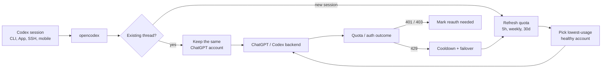

<h3 align="center">make codex open!</h3>
<p align="center"><b>Universal provider proxy for OpenAI Codex &amp; Claude Code</b> — use any LLM with Codex CLI, App, SDK, and Claude Code.</p>
<p align="center"><code>npm install -g @bitkyc08/opencodex</code> · <code>ocx start</code> · <b>localhost:10100</b></p>

<p align="center">
  <a href="https://www.npmjs.com/package/@bitkyc08/opencodex"></a>
  <a href="https://github.com/lidge-jun/opencodex/blob/main/LICENSE"></a>
  
</p>

<p align="center">
  
</p>

<p align="center">
  <a href="README.md">English</a> · <a href="README.ko.md">한국어</a> · <a href="README.zh-CN.md">简体中文</a> · 📖 <a href="https://lidge-jun.github.io/opencodex/"><b>Full documentation →</b></a>
</p>

<p align="center">
  
</p>

Use Claude, Gemini, Grok, GLM, DeepSeek, Kimi, Qwen, Ollama, or any other LLM with Codex — and with **Claude Code** — without waiting for anyone to add support.

opencodex is a lightweight local proxy that translates Codex's Responses API into whatever your provider speaks. Streaming, tool calls, reasoning tokens, images — everything works, in both directions.

<p align="center">
  
</p>
<p align="center"><sub><b>Codex, running any model.</b> Pick a provider and go — same Codex workflow, different brain.</sub></p>

It can also manage a **ChatGPT account pool** for Codex auth. Add multiple ChatGPT / Codex accounts,
refresh their 5h / weekly / 30d quota in the dashboard, and let new sessions auto-route to the
lowest-usage healthy account. Existing Codex threads stay pinned to the account that started them,
so long SSH, tmux, or mobile-connected sessions do not jump accounts mid-conversation.

```
Codex CLI / App / SDK ──/v1/responses──▶ opencodex ──▶ Any provider
                                              │
              Anthropic · Google · xAI · Kimi · Ollama Cloud · Groq
              OpenRouter · Azure · DeepSeek · GLM · …and OpenAI itself
```



## This fork: Ultimate Context, Linux MCP, and always-on setup

This fork keeps the upstream OpenCodex feature set and adds a local, reversible context-efficiency layer. It works at two disjoint boundaries:

- [Ahmed-Fawzy-Coder/linux_mcp](https://github.com/Ahmed-Fawzy-Coder/linux_mcp) bounds project search, file reads, commands, tests, and logs;
- OpenCodex covers large results from other native tools, plugins, MCP servers, browser tools, and subagents.

Large text results are stored locally behind opaque content-addressed handles. The model receives a deterministic preview plus a bounded retrieval command. Small results, images, encrypted blocks, unknown items, and Linux MCP results already reduced at the first boundary are not transformed.

The single **Ultimate Context** panel at `http://localhost:10100/#usage` shows live values since reset:

- the calculated estimated savings percentage;
- estimated tokens before, returned, and saved;
- processed and reduced results, retrievals, cache hits, and average added latency;
- an optional Linux MCP versus other-tools breakdown.

The panel never imports a fixed benchmark percentage and does not alter provider-reported `Total tokens`. Token estimates use `4 characters or bytes ≈ 1 token`. OpenCodex reads Linux MCP metrics with a short timeout; a telemetry failure cannot fail the Usage page.

The Usage page does not poll automatically. Reload it manually or change the `7d`, `30d`, or `All` filter when you want fresh statistics.

Enable the universal OpenCodex layer globally in `~/.opencodex/config.json`:

```json
{
  "enforceLinuxMcp": true,
  "ultimateContext": {
    "enabled": true,
    "mode": "auto",
    "thresholdBytes": 8192,
    "previewBytes": 2048,
    "ttlMs": 86400000,
    "maxEntries": 512,
    "maxBytes": 67108864,
    "retrievalMaxBytes": 12000
  }
}
```

`enforceLinuxMcp` defaults to `true`. For routed non-OpenAI providers, when Codex supplies the
unified freeform `exec` tool, OpenCodex makes that surface authoritative for local workspace work:
native read/search/shell tools and `tool_search` are removed, and the model is instructed to call
`tools.mcp__linux_mcp__workspace` from `exec.ALL_TOOLS`. If `exec` is absent the policy is a no-op,
so the original tool catalog remains available as a recovery path. If the gateway remains unavailable
after one retry, the model may use a nested fallback such as `tools.exec_command` from the same
`exec.ALL_TOOLS` catalog. Set the option to `false` only when intentionally testing the top-level
native fallback.

For a sanitized enforcement trace during diagnosis, start OpenCodex with
`OPENCODEX_LINUX_MCP_DEBUG=1`. Trace lines include only provider/model identity, enforcement status,
tool type/name pairs, and boolean classifications of upstream tool calls; request content, tool
arguments, descriptions, headers, and secrets are never logged.

`auto` preserves small results and reduces only results at or above the threshold. `off` is the immediate kill switch. `compact` forces every eligible textual result through the reversible store and is intended for testing, not the global default.

OpenCodex also bounds its in-memory Responses continuation cache to 32 MiB by default and evicts
least-recently-used chains. Override that process-wide limit only when necessary with
`OPENCODEX_RESPONSE_STATE_MAX_BYTES=<bytes>`; the disk snapshot remains separately capped and
oversized histories retain only a self-contained recent suffix with no dangling tool outputs.

Retrieve an omitted snapshot chunk locally:

```bash
ocx context get ctx_HANDLE --offset 0 --max-bytes 12000
```

The compact result includes the exact command and ETag needed for conditional retrieval. Handles accept no paths, retrieval is size-bounded, and snapshot files are stored with private permissions under `~/.opencodex/context-results/`.

### Install this fork from source

Requirements:

- Node.js 18 or newer, preferably through `nvm` or `fnm`.
- Git.
- Linux with systemd for the always-on service instructions below.

```bash
git clone https://github.com/Ahmed-Fawzy-Coder/opencodex.git
cd opencodex
npm install --no-package-lock
npm run build:gui
npm install -g .
```

Do not use `--ignore-scripts` or omit optional dependencies; OpenCodex installs its bundled Bun runtime during installation.

Confirm the fork is installed:

```bash
ocx --version
ocx doctor
```

### Initial OpenCodex configuration

```bash
ocx init
ocx gui
```

The dashboard opens at:

```text
http://127.0.0.1:10100
```

Add at least one provider, choose its default model, and confirm it appears in the model catalog. Provider credentials remain in `~/.opencodex/config.json`; do not commit that file.

### Complete installation order: OpenCodex + Linux MCP

For a fresh machine, use this order so every dependency is ready before Codex Desktop opens:

1. Install this OpenCodex fork from source and run `ocx init`.
2. Install Linux MCP with `./scripts/install-systemd-user.sh` from its repository.
3. Put the Linux MCP block in the global `~/.codex/config.toml` and copy its global agent rules into `~/.codex/AGENTS.md`.
4. Enable the OpenCodex Ultimate Context configuration in `~/.opencodex/config.json` if it is not already enabled.
5. Install the OpenCodex background service with `ocx service install`.
6. Enable user lingering once with `loginctl enable-linger "$USER"`.
7. Completely quit and reopen Codex Desktop so it reloads the proxy and MCP configuration.
8. Run the combined verification commands below before starting real work.

The two local layers have different jobs and can run independently:

| Layer | Address | Responsibility |
| --- | --- | --- |
| OpenCodex | `http://127.0.0.1:10100` | Provider proxy, account/model routing, Usage UI, and reversible reduction of large non-Linux-MCP tool results |
| Linux MCP | `http://127.0.0.1:8000/mcp` | Token-bounded local project search, reads, edits, commands, tests, jobs, and logs |

There is no required service startup order. OpenCodex tolerates Linux MCP telemetry being temporarily unavailable, and Codex's MCP startup grace period lets Linux MCP finish its first Python import. Both services should nevertheless be enabled and healthy before a new Codex task begins.

### Start OpenCodex automatically at boot

Install or update the official user service:

```bash
ocx service install
```

`ocx service` with no subcommand is an alias for `ocx service install`.

Before installation, make sure the command resolves in the same user account that will run Codex:

```bash
command -v ocx
ocx --version
ocx doctor
```

This matters especially when Node was installed with `nvm` or `fnm`. The generated service stores absolute executable paths, so it does not depend on an interactive shell's `PATH` after installation. Rerun `ocx service install` after changing Node versions, moving the global package, or installing a newer source build.

On Linux, enable user lingering so the systemd user manager can start the proxy at boot even before an interactive desktop login:

```bash
loginctl enable-linger "$USER"
```

If the command needs administrator authorization on your distribution:

```bash
sudo loginctl enable-linger "$USER"
```

Verify that it actually succeeded:

```bash
loginctl show-user "$USER" -p Linger
```

The expected value is `Linger=yes`. Without lingering, the service still starts automatically at desktop login; with lingering, the user's systemd manager starts it during computer boot before an interactive login.

Verify the service:

```bash
ocx service status
systemctl --user is-enabled opencodex-proxy.service
systemctl --user is-active opencodex-proxy.service
curl http://127.0.0.1:10100/healthz
```

Once the service is installed, you do not need to run `ocx start` after every reboot. The unit restarts OpenCodex automatically after failures.

On Linux the unit is stored at:

```text
~/.config/systemd/user/opencodex-proxy.service
```

The package configuration, usage data, context snapshots, token file, and service log remain under `~/.opencodex/`. Keep that directory private and never commit it.

### What happens after every reboot

1. systemd starts the user's service manager because `Linger=yes`.
2. `opencodex-proxy.service` starts and binds to the configured loopback port, normally `10100`.
3. `linux-mcp.socket` and `linux-mcp.service` become available on loopback port `8000`.
4. Codex Desktop opens and reads its global proxy and MCP configuration.
5. New tasks can use the provider proxy and the compact Linux MCP `workspace` gateway immediately.

Do not add `ocx start` to `.bashrc`, `.profile`, desktop startup applications, or cron when the systemd service is installed. Starting a second manual proxy can create port conflicts and make service status misleading.

### Prove both services start automatically

Before rebooting:

```bash
systemctl --user is-enabled opencodex-proxy.service linux-mcp.socket linux-mcp.service
loginctl show-user "$USER" -p Linger
```

Expected output is three `enabled` lines and `Linger=yes`. Reboot the computer, do not run `ocx start` or `start-linux-mcp`, then run:

```bash
systemctl --user is-active opencodex-proxy.service linux-mcp.socket linux-mcp.service
curl --fail --silent --show-error http://127.0.0.1:10100/healthz
curl --fail --silent --show-error http://127.0.0.1:8000/health
```

Expected output is three `active` lines and two successful health responses. Finally open:

```text
http://127.0.0.1:10100/#usage
```

The page refreshes only when you reload it or change its range filter.

### Daily service controls

| Goal | Preferred command |
| --- | --- |
| Install/update and start the service | `ocx service install` |
| Show OpenCodex service diagnostics | `ocx service status` |
| Start an installed service | `ocx service start` |
| Stop the service and restore native Codex | `ocx service stop` |
| Remove only the background service | `ocx service uninstall` |
| Check the proxy process/config | `ocx status` |
| Run full diagnostics | `ocx doctor` |
| Open the dashboard | `ocx gui` |
| Read the bounded service log | `tail -n 100 ~/.opencodex/service.log` |
| Read systemd journal entries | `journalctl --user -u opencodex-proxy.service -n 100 --no-pager` |

Prefer `ocx service stop` over a raw `systemctl stop` when you intentionally want to return to native Codex, because the OpenCodex command also restores the native Codex configuration. A raw `systemctl --user restart opencodex-proxy.service` is appropriate for a quick maintenance restart.

If `ocx service` reports that port `10100` is already in use by a manually started proxy, convert it cleanly:

```bash
systemctl --user stop opencodex-proxy.service
ocx stop
systemctl --user reset-failed opencodex-proxy.service
systemctl --user start opencodex-proxy.service
```

### Install and connect Linux MCP

Follow the complete Linux MCP guide:

```text
https://github.com/Ahmed-Fawzy-Coder/linux_mcp#quick-start
```

At minimum:

```bash
git clone https://github.com/Ahmed-Fawzy-Coder/linux_mcp.git
cd linux_mcp
./scripts/install-systemd-user.sh
```

Then add the global MCP block from `linux_mcp/examples/codex-config.toml` to `~/.codex/config.toml`, using the same bearer token as `linux_mcp/mcp_server/.env`. Add `linux_mcp/examples/AGENTS.md` to your global `~/.codex/AGENTS.md`, then fully restart Codex Desktop.

Check telemetry directly:

```bash
curl 'http://127.0.0.1:8000/metrics?range=30d'
```

Open the combined dashboard:

```text
http://127.0.0.1:10100/#usage
```

The Ultimate Context panel remains available even before provider usage is recorded, so the two local layers can be diagnosed independently.

### Reset Usage and Linux MCP statistics

This permanently removes the local statistics. Stop both writers before deleting their files:

```bash
systemctl --user stop opencodex-proxy.service
systemctl --user stop linux-mcp.service linux-mcp.socket
rm -- ~/.opencodex/usage.jsonl
rm -- ~/.opencodex/ultimate-context-metrics.json
rm -rf -- ~/.opencodex/context-results
rm -- /absolute/path/to/linux_mcp/mcp_server/audit.log
systemctl --user start linux-mcp.socket linux-mcp.service
systemctl --user start opencodex-proxy.service
```

Verify the reset:

```bash
curl 'http://127.0.0.1:8000/metrics?range=all'
curl 'http://127.0.0.1:10100/api/usage?range=all&surface=all'
```

### Update this fork

From the cloned repository:

```bash
git pull --ff-only
npm install --no-package-lock
npm run build:gui
npm install -g .
ocx service
```

The final `ocx service` updates and restarts the systemd service with the newly installed source.

### Logs and troubleshooting

```bash
ocx status
ocx service status
journalctl --user -u opencodex-proxy.service -n 100 --no-pager
systemctl --user status opencodex-proxy.service
tail -n 100 ~/.opencodex/service.log
```

If the proxy is healthy but Codex does not route through it, run `ocx doctor` and review the Codex shim/account-mode diagnostics. For Codex Desktop, the always-on service keeps the proxy available even when an on-demand CLI shim is not being used.

For a complete global-routing check, confirm all of the following:

```bash
ocx doctor
rg -n 'openai_base_url|model_catalog_json' ~/.codex/config.toml
systemctl --user is-active opencodex-proxy.service
```

`ocx doctor` should report a running proxy and no project-local provider bypass. The injected Codex configuration should point `openai_base_url` to `http://127.0.0.1:10100/v1` and use the OpenCodex model catalog. Start a new read-only Codex task and confirm its request appears in OpenCodex Usage; already-open tasks may retain routing state loaded before the configuration changed.

#### Codex reports `ran out of room` while the meter is below the limit

Quit and reopen Codex after upgrading this fork, then start a new task. Older GPT-5.6 catalog
metadata advertised 372,000 tokens and an effective 353,400-token meter even though the current
native Codex window is 272,000; that made roughly 60–70% on the old meter close to the real limit
and delayed compaction until too late. The synchronized entries must now contain:

```bash
rg -n '"context_window": 272000|"auto_compact_token_limit": 244800' \
  ~/.codex/opencodex-catalog.json ~/.codex/models_cache.json
```

If either file still shows 372,000 for GPT-5.6 Sol/Terra/Luna, run `ocx service restart`, wait for
catalog synchronization, completely quit/reopen Codex, and create a new task. Existing tasks keep
the context metadata captured when they started.

#### Codex logs `426 Upgrade Required` and falls back to HTTP

Some Codex builds probe the Responses WebSocket URL even when their listed WebSocket feature flags are removed or disabled. OpenCodex may answer that probe with `426 Upgrade Required`; Codex then logs `falling back to HTTP` and continues through the supported HTTP/SSE path. If the turn proceeds normally, the health endpoint succeeds, and Usage records the request, this warning is not a proxy failure. Do not enable WebSocket transport merely to hide the warning.

If the Linux MCP card is missing:

1. Confirm `curl http://127.0.0.1:8000/metrics?range=30d` succeeds.
2. Confirm OpenCodex has at least one recorded request.
3. Reload `http://127.0.0.1:10100/#usage` manually.
4. Check that Linux MCP is bound to `127.0.0.1:8000`.

#### `ocx` works in one terminal but is not found elsewhere

Find the npm global binary directory and add it to the target user's shell `PATH`:

```bash
npm prefix -g
command -v ocx
```

With `nvm` or `fnm`, open a shell that initializes the version manager, reinstall this fork if needed, and rerun `ocx service install`. The installed service itself uses absolute paths; the shell needs `ocx` only to manage or update it.

#### Service is enabled but did not start after reboot

```bash
loginctl show-user "$USER" -p Linger -p State
systemctl --user is-enabled opencodex-proxy.service
systemctl --user status opencodex-proxy.service --no-pager
journalctl --user -u opencodex-proxy.service -b -n 100 --no-pager
```

Confirm `Linger=yes`. If the unit contains an old Node/Bun path, rerun `ocx service install` from the currently installed fork.

#### Port `10100` is already in use

```bash
ss -ltnp | grep ':10100'
ocx status
systemctl --user status opencodex-proxy.service --no-pager
```

Stop the manually launched proxy with `ocx stop`, then start the installed service with `ocx service start`. Do not kill an unrelated process until you identify it.

#### Run without systemd

On Docker, WSL without systemd, or another environment without a user service manager, run OpenCodex under the environment's process supervisor:

```bash
ocx start
```

For supported WSL releases, enable systemd in `/etc/wsl.conf`, run `wsl --shutdown` from Windows, reopen the distribution, and then use `ocx service install`. Linux MCP likewise requires either its systemd user units or a separate supervisor/manual process.

### Uninstall the background service

```bash
ocx service uninstall
```

This removes the service but leaves the OpenCodex package and configuration. The broader `ocx uninstall` command can remove service, shim, and configuration; read its prompt carefully before confirming.

## Supported platforms

| OS | Status | Service manager |
|---|---|---|
| macOS (arm64 / x64) | Fully supported | launchd |
| Linux (x64 / arm64) | Fully supported | systemd (user unit) |
| Windows (x64) | Fully supported | Task Scheduler (hidden) / opt-in native service (`--native`, WinSW) |

Requires [Node](https://nodejs.org) 18+. The Bun runtime is bundled automatically on `npm install` — no separate Bun install needed. All three platforms work natively (no WSL needed on Windows).

## Quick start

```bash
# Install (bundles the Bun runtime automatically — only Node 18+ required)
# Prefer a user-owned Node (nvm/fnm) — avoid `sudo npm install -g …`
npm install -g @bitkyc08/opencodex

# Interactive setup (writes config, injects into Codex, and offers autostart shim install)
ocx init

# Start the proxy
ocx start

# If you skipped it during init, install the on-demand autostart shim later
ocx codex-shim install

# Use Codex normally — it now routes through opencodex
codex "Write a hello world in Rust"
```

<details>
<summary><b>"bundled Bun runtime is missing" / npm blocked Bun install scripts?</b></summary>

<br/>

opencodex bundles the Bun runtime as a dependency and runs it via a Node
launcher, so you do **not** need to install Bun yourself. If you see a
"bundled Bun runtime is missing" error, the install skipped lifecycle scripts
(including npm blocking bun's postinstall under `allowScripts`) or optional
dependencies. Reinstall without those flags, allowing bun's install script:

```bash
npm install -g --allow-scripts=bun @bitkyc08/opencodex   # no --ignore-scripts, no --omit=optional

# if the original install used sudo, keep using sudo:
sudo npm install -g --allow-scripts=bun @bitkyc08/opencodex
```

npm's own warning suggests an abbreviated command without the package name —
that would reinstall the current directory, so always pass
`@bitkyc08/opencodex` explicitly.

If you installed with `sudo` into a root-owned prefix, the sudo reinstall above
unblocks that prefix — but prefer migrating to a user-owned Node (nvm, fnm, or
a user npm prefix) when you can.

</details>

## Add a provider

The fastest way to add a provider is through the web dashboard:

```bash
ocx gui
```

This opens the dashboard at `http://localhost:10100`. From there:

1. Click **"Add Provider"**
2. Pick from **40+ built-in providers** — or enter a custom OpenAI-compatible endpoint
3. Paste your API key (or log in via OAuth for Anthropic, xAI, and Kimi)
4. Models are **auto-discovered** from the provider's `/v1/models` endpoint

Your new provider is ready to use immediately. No restart needed.

You can also add providers through `ocx init` (interactive CLI) or by editing `~/.opencodex/config.json` directly.

## Model routing

Target any configured provider and model using the `provider/model` syntax:

Providers whose own model ids contain `/` (zenmux, openrouter, nvidia, …) are exposed to
Codex with inner slashes aliased to `-` (e.g. `zenmux/moonshotai-kimi-k3-free`); the
proxy transparently routes them back to the native id, and the raw full-slash form keeps
working too.

```bash
# Use Claude Opus through Anthropic
codex -m "anthropic/claude-opus-4-8" "Explain this stack trace"

# Use Gemini through Google
codex -m "google/gemini-3-pro" "Write unit tests for auth.ts"

# Use GLM through Ollama Cloud
codex -m "ollama-cloud/glm-5.2" "Write a SQL migration"

# Use a local model through Ollama
codex -m "ollama/llama3" "Refactor this function"
```

When you omit the `provider/` prefix, opencodex routes to the default provider — or auto-matches based on the model name pattern (e.g., `claude-*` routes to Anthropic, `gpt-*` routes to OpenAI).

Routed models also appear in the **Codex App** model picker with per-model reasoning effort controls:

Current Codex builds can expose `low`, `medium`, `high`, `xhigh`, `max`, and `ultra` reasoning
controls when a model advertises them. opencodex keeps `xhigh` and `max` distinct unless a provider
config explicitly maps one to the other. `ultra` mirrors upstream Codex semantics: it selects
maximum reasoning plus proactive multi-agent delegation in the client, and is converted to `max`
before any request reaches a provider. Routed models advertise it only when a provider config opts
in via `reasoningEfforts`.

GPT-5.6 Sol/Terra/Luna are seeded as rollout-ready catalog entries for the OpenAI API key and
OpenRouter presets (`gpt-5.6-sol`, `gpt-5.6-terra`, `gpt-5.6-luna`; OpenRouter uses
`openai/...`). They remain preview-gated by upstream availability; opencodex only prepares the
routing and catalog metadata for accounts and providers that can serve them.

<p align="center">
  
</p>

## OpenAI provider account modes

| Provider ID | Route | Credential | Behavior |
|---|---|---|---|
| `openai` | Codex login | Main + added Codex accounts | Pool by default; optional Direct mode |
| `openai-apikey` | OpenAI API | API key/key pool | No Codex account routing |

- Pool includes the main Codex login and added accounts, with affinity, quota, cooldown, and failover.
- Direct short-circuits pool state and uses only the current caller/main-login bearer.
- Fresh installs and configs with no persisted mode default to Pool. Change the mode on the
  dashboard's **Providers** page; model ids stay bare in either mode.
- The legacy public provider id `chatgpt` is hidden after migration. The original config is retained
  once at `~/.opencodex/config.json.pre-openai-tiers-v2.bak`; restore it with
  `cp ~/.opencodex/config.json.pre-openai-tiers-v2.bak ~/.opencodex/config.json`.
- Current configs use `openaiProviderTierVersion: 2`. Earlier v1 three-provider configs migrate
  automatically into the single `openai` row.
- The API tier includes Pro virtual models (`gpt-5.6-sol-pro`, `gpt-5.6-terra-pro`,
  `gpt-5.6-luna-pro`). At the wire level, each rewrites to its base model with
  `reasoning.mode: "pro"`.
- Its catalog is fixed to eight ids: `gpt-5.5`, `gpt-5.6`, Sol/Terra/Luna, and the three
  corresponding Pro virtual ids. There is no generic `gpt-5.6-pro` alias.
- Compact requests keep the selected tier but send the base model without a reasoning object.
- Official API metadata is 1,050,000 context tokens and 922,000 max input tokens.

Use `gpt-5.6-sol` for the configured `openai` account mode and
`openai-apikey/gpt-5.6-sol` for the API key. Codex-login and API credentials never fall through to
one another.

### Pool account behavior

Open **Codex Auth** in the dashboard to add accounts and choose which account should handle the
next Codex session. opencodex keeps these behaviors:

- **Existing sessions keep affinity.** A thread id is bound to the selected account and reused on
  later turns, so a long request or a mobile/SSH-attached session keeps using the same account.
- **New sessions can auto-route.** When auto-switch is enabled, opencodex compares the hottest known
  quota window across 5h, weekly, and 30d usage, then picks a lower-usage eligible account for new
  sessions once the active account crosses the threshold.
- **Quota lookup is built in.** The dashboard can refresh all account quotas in one click, and the
  request log labels pool traffic with non-PII account ordinals.
- **Failures fail closed.** Token failures mark reauthentication instead of falling back to another
  credential silently; 429 quota responses put the account in cooldown and can fail over future work
  to another eligible pool account.

## Highlights

- **Use any LLM with Codex.** 5 protocol adapters cover Anthropic Messages, Google Gemini, Azure, OpenAI Responses passthrough, and every OpenAI-compatible Chat Completions endpoint — that's 40+ providers out of the box.
- **Use any LLM with Claude Code too.** The same daemon serves the Anthropic Messages API (`/v1/messages` + `count_tokens`): `ocx claude` launches Claude Code fully wired, and routed models appear in its native `/model` picker via gateway model discovery (`claude-ocx-<provider>--<model>` aliases, Claude Code 2.1.129+). Configure slots and model maps on the dashboard's Claude page.
- **Pool ChatGPT accounts safely.** Keep existing Codex threads on one account while new sessions
  can auto-pick a lower-usage account from the pool, with quota refresh and non-PII request labels.
- **Log in once, skip the API key.** OAuth support for xAI, Anthropic, and Kimi means you can authenticate with your existing account. Tokens auto-refresh. Or forward your `codex login`, paste an API key, or use `${ENV_VAR}` references — your call.
- **Works everywhere Codex does.** Injects into Codex CLI, TUI, App, and SDK automatically. Routed models show up in Codex's model picker just like native ones.
- **History-safe injection.** On local installs the proxy points Codex's own built-in `openai` provider at itself via a single `openai_base_url` line — new threads keep their native provider tag, so ongoing chat history is never remapped and an unclean shutdown can't hide it. (Threads re-tagged by older versions are migrated back once on the first start; remote/LAN binds use a dedicated provider entry instead, since they need an API-key header.)
- **Delegate to the right model.** Feature up to five routed or native models in Codex's subagent picker from the dashboard or config — route complex tasks to a reasoning model, fast tasks to a cheap one. On the v2 multi-agent surface (GPT-5.6 Sol/Terra) the proxy injects compact delegation guidance: a preferred sub-agent model and effort (`injectionModel` / `injectionEffort`), the featured-model roster with the effort ladder each supports, and the `fork_turns` rules that let cross-model `spawn_agent` calls apply their overrides. Known limitation: when a native parent spawns a routed child, the task body can currently arrive backend-encrypted and be lost ([#92](https://github.com/lidge-jun/opencodex/issues/92)) — use the v1 surface for reliable cross-provider delegation. Want your own wording? Set `injectionPrompt` with `{{model}}` / `{{effort}}` / `{{roster}}` placeholders.
- **Prepare for preview-gated OpenAI rollouts.** GPT-5.6 Sol/Terra/Luna entries preserve the upstream effort ladders. Direct/Multi use the 372k Codex contract; OpenAI API and OpenRouter use 1.05M metadata when upstream access is available.
- **Give any model superpowers.** Non-OpenAI models get real web search and image understanding via a `gpt-5.4-mini` sidecar over your ChatGPT login.
- **Generate images natively.** Codex's standalone `image_gen` tool uses `POST /v1/images/generations` for generation and `POST /v1/images/edits` for edits; it is separate from the hosted Responses `image_generation` tool.
- **See what's happening.** The web dashboard shows providers, OAuth status, model selection, and a live request log, including cached/cache-write token counts when upstream reports them — no more guessing why a request failed.
- **Runs in the background.** Install as a system service (launchd / systemd / Task Scheduler) and forget about it. On macOS/Linux the proxy starts at login; on Windows the default Task Scheduler backend starts at logon (windowless), or use `ocx service install --native` for a real Windows service that starts at boot.
- **Clean exit, zero residue.** `ocx stop` (or the dashboard's Stop button) shuts down the proxy, stops the background service if one is installed, and restores Codex to its original configuration. Plain `codex` works exactly as it did before — no leftover config, no orphaned processes.

## Providers & adapters

| Provider | Adapter | Auth |
|---|---|---|
| OpenAI (ChatGPT login) | `openai-responses` | forward (no key) |
| OpenAI (API key) | `openai-responses` | key |
| Umans AI Coding Plan | `anthropic` | key |
| Anthropic Claude | `anthropic` | oauth / key |
| xAI Grok | `openai-chat` | oauth / key |
| Kimi (Moonshot) | `openai-chat` | oauth / key |
| Google Gemini | `google` | key |
| Azure OpenAI | `azure-openai` | key |
| Cursor (experimental) | `cursor` | dashboard/local config; live transport; unsafe native local exec is opt-in |
| Ollama Cloud + 17-provider catalog | `openai-chat` | key |
| Ollama / vLLM / LM Studio (local) | `openai-chat` | key (usually blank) |
| Any OpenAI-compatible endpoint | `openai-chat` | key |

Plus DeepSeek, Groq, OpenRouter, Together, Fireworks, Cerebras, Mistral, Hugging Face, NVIDIA NIM, MiniMax, Qwen Cloud, and more. See the full list with `ocx init` or in the [provider docs](https://lidge-jun.github.io/opencodex/reference/configuration/).

Cursor support is a staged experimental bridge: it appears in `ocx init` and the dashboard Add
Provider picker as a local config with Cursor's static public model catalog. Live
HTTP/2 transport is enabled when a Cursor access token is configured. Cursor server-driven native
read/write/delete/ls/grep/shell/fetch execution is disabled by default because it bypasses Codex's
approval and sandbox path; set `unsafeAllowNativeLocalExec: true` only for trusted local
experiments.
MCP, screen recording, and computer-use are exposed through executor hooks; when no local executor
is configured, opencodex returns typed no-executor results instead of policy-blocking the request.
Cursor OAuth and live model discovery are enabled for the experimental Cursor adapter.

## CLI

```bash
ocx init                       # interactive setup
ocx start [--port 10100]       # start the proxy; falls back to a free port if busy
ocx stop                       # stop + restore native Codex
ocx restore                    # restore without stopping (alias: ocx eject)
ocx uninstall                  # remove service/shim/config and restore native Codex
ocx ensure                     # start if needed + refresh Codex config/cache
ocx sync                       # refresh models + re-inject into Codex
ocx codex-shim install         # run `ocx ensure` whenever `codex` is launched
ocx status                     # is the proxy running?
ocx login <provider>          # OAuth login (xai, anthropic, kimi, cursor, ...)
ocx logout <provider>          # remove a stored login
ocx gui                        # open the web dashboard
ocx claude [args...]           # launch Claude Code wired to the proxy (model discovery on)
ocx service [install|start|stop|status|uninstall]   # install/update/start background service
ocx update [--tag preview]     # update opencodex; preview installs stay on @preview
```

### Autostart: service vs shim

opencodex has two ways to auto-start the proxy:

| | `ocx service` / `ocx service install` | `ocx codex-shim install` |
|---|---|---|
| **How** | OS service manager (launchd / systemd / schtasks) | Wraps script launchers for `codex`; real `codex.exe` is left untouched |
| **When** | Always running after login | On-demand — runs `ocx ensure` when `codex` is launched |
| **Restart** | Auto-restarts on crash | Starts once per `codex` invocation |
| **Codex updates** | Unaffected | Repairs on next `ocx codex-shim install` or `ocx update` |
| **Remove** | `ocx service uninstall` | `ocx codex-shim uninstall` |

Use the **service** for always-on proxy (recommended for development machines). Use the **shim** for
lightweight, on-demand proxy startup without a background daemon. Shim autostart is enabled by default
and can be disabled from the GUI dashboard. If the configured proxy port is already busy, `ocx start`
automatically picks another free local port and updates Codex to use it.

Codex Desktop users should prefer the service. The shim is triggered only when the wrapped `codex` command is launched, so it is not a guarantee that the proxy is already running when the desktop application opens. Installing both is supported, but the service is the component that provides computer-boot availability.

### Uninstall

Before removing the npm package, clean up local state:

```bash
ocx uninstall
npm uninstall -g @bitkyc08/opencodex
```

`ocx uninstall` stops the proxy, removes any installed service, removes the Codex shim, restores
native Codex config/catalog/history, and deletes `~/.opencodex`.

## Configuration

Config lives at `~/.opencodex/config.json`. If the file cannot be parsed (e.g. truncated or
manually broken JSON), opencodex backs it up to `config.json.invalid-<timestamp>`, prints a warning,
and falls back to defaults — so your original file is never silently lost.

Here's a typical multi-provider setup:

```json
{
  "port": 10100,
  "defaultProvider": "anthropic",
  "providers": {
    "anthropic": {
      "adapter": "anthropic",
      "baseUrl": "https://api.anthropic.com",
      "authMode": "oauth",
      "defaultModel": "claude-sonnet-4-6"
    },
    "ollama-cloud": {
      "adapter": "openai-chat",
      "baseUrl": "https://ollama.com/v1",
      "apiKey": "${OLLAMA_API_KEY}",
      "defaultModel": "glm-5.2"
    }
  }
}
```

Provider entries can also annotate routed catalog metadata. Use `contextWindow` for a provider-wide
Codex-visible context cap, `modelContextWindows` for model-specific caps, and
`modelInputModalities` for model-specific catalog input hints such as `["text"]` or
`["text", "image"]`. Context values cap live `/models` metadata; they never raise a smaller live
context window. The bundled GPT-5.6 Sol/Terra/Luna fallback metadata uses a 1,050,000-token context
window for OpenAI API key and OpenRouter catalog entries; it does not bypass upstream preview
access. Native Codex account entries for GPT-5.6 Sol/Terra/Luna use a 272,000-token raw window and
compact automatically at 244,800 tokens (90%), leaving headroom for tool schemas, instructions,
and the next model output. See the configuration reference for the full field list.

> **GLM-5.2 1M context via Z.AI:** through the `openai-chat` adapter, both `glm-5.2`
> and `glm-5.2[1m]` work — opencodex strips the trailing `[1m]` suffix before
> sending the request, since OpenAI-compatible endpoints reject the bracketed id
> (Z.AI 400 code 1211). The `[1m]` suffix is a Claude-Code / Anthropic-endpoint
> convention; to use it natively, point the `anthropic` adapter at Z.AI's coding
> base (`https://api.z.ai/api/coding/paas/v4`). Set the 1M context window via the
> model catalog (`modelContextWindows`), not the model name.

Local models work too. Point opencodex at any OpenAI-compatible server running on your machine:

```json
{
  "port": 10100,
  "defaultProvider": "ollama",
  "providers": {
    "ollama": {
      "adapter": "openai-chat",
      "baseUrl": "http://localhost:11434/v1",
      "authMode": "key",
      "apiKey": "",
      "defaultModel": "llama3"
    },
    "vllm": {
      "adapter": "openai-chat",
      "baseUrl": "http://localhost:8000/v1",
      "authMode": "key",
      "apiKey": "",
      "defaultModel": "Qwen/Qwen3-32B"
    }
  }
}
```

OpenCodex WebSocket transport is off by default. Set `"websockets": true` only when both the selected provider path and client support it and you intentionally want Codex to advertise the Responses WebSocket path instead of HTTP/SSE. A client-side WebSocket probe followed by a successful HTTP fallback does not require enabling this option.

### Remote access

By default opencodex binds to `127.0.0.1` (loopback) and requires no extra authentication.
If you set `"hostname": "0.0.0.0"` to expose the proxy on the LAN, opencodex requires a bearer token
to protect both the management API (`/api/*`) and the data-plane (`/v1/responses`,
`/v1/images/generations`, and `/v1/images/edits`):

```bash
export OPENCODEX_API_AUTH_TOKEN="your-secret-token"
ocx start
```

The proxy refuses to start without this variable when binding beyond loopback. If you install a
background service for LAN access, export the same variable before `ocx service install` so the
service manager receives it.
Clients (scripts, remote machines) must include the token in every request:

```
x-opencodex-api-key: your-secret-token
```

The token is compared in constant time to prevent timing attacks.

opencodex automatically remaps Codex resume history so old OpenAI chats and opencodex-created project
threads stay visible in Codex App while the proxy is active. opencodex records the original provider/source metadata in
`~/.opencodex/codex-history-backup.json`. `ocx stop` / `ocx restore` restores backed-up OpenAI rows
to OpenAI, and ejects any remaining opencodex user threads to OpenAI as well so native Codex does not
try to resume a thread whose provider no longer exists in `config.toml`.

If you tested an older development build where `syncResumeHistory` already remapped history before
backup support existed, you can also run the explicit recovery command:

```bash
ocx recover-history --legacy-openai
```

See the **[Configuration reference](https://lidge-jun.github.io/opencodex/reference/configuration/)** for every field.

## Documentation

The public docs — install, providers, routing, sidecars, Codex integration, Codex App model picker, and CLI/config reference — are built from [`docs-site/`](./docs-site) and published to **[lidge-jun.github.io/opencodex](https://lidge-jun.github.io/opencodex/)**.

Maintainer source-of-truth notes live under [`structure/`](./structure). Historical investigations remain under [`docs/`](./docs).
Contributor setup lives in [`CONTRIBUTING.md`](./CONTRIBUTING.md), and security reporting guidance
lives in [`SECURITY.md`](./SECURITY.md).

## Development

```bash
git clone https://github.com/lidge-jun/opencodex.git
cd opencodex
bun install
bun run dev:proxy    # start the proxy API in dev mode
bun run dev:gui      # start the dashboard dev server in another terminal
bun x tsc --noEmit   # typecheck
```

`bun run dev` remains an alias for `bun run dev:proxy` for compatibility. In a source checkout,
the proxy API exposes `/healthz`, `/v1/responses`, `POST /v1/images/generations`,
`POST /v1/images/edits`, and `/api/*`; `GET /` serves the packaged dashboard only after
`bun run build:gui` has produced `gui/dist`. While hacking on the dashboard, run the frontend separately:

```bash
bun run dev:gui
```

See **[Contributing](./CONTRIBUTING.md)**.

## Disclaimer

opencodex is an independent, community-maintained project and is **not affiliated with or endorsed by OpenAI, Anthropic, or any other provider**.

Some providers — notably Anthropic (Claude) — may suspend or restrict accounts that route API traffic through third-party proxies. **Use at your own risk (UAYOR).** Before connecting a provider, review its Terms of Service to confirm that proxy-based access is permitted. The opencodex maintainers are not responsible for any account actions taken by upstream providers.

## License

MIT
